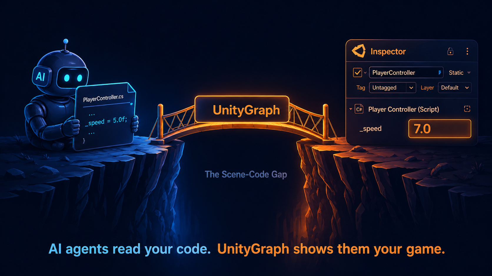
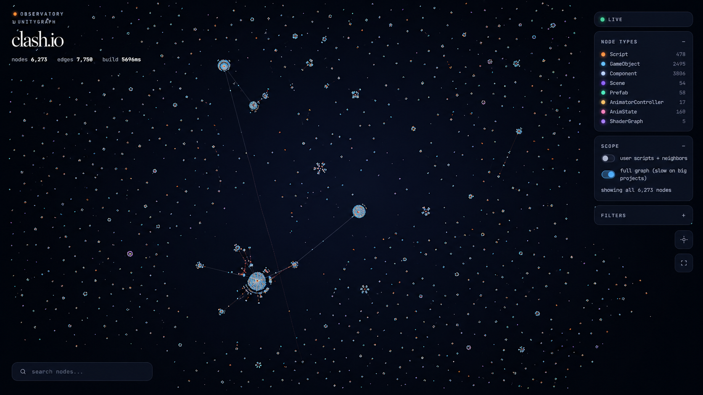
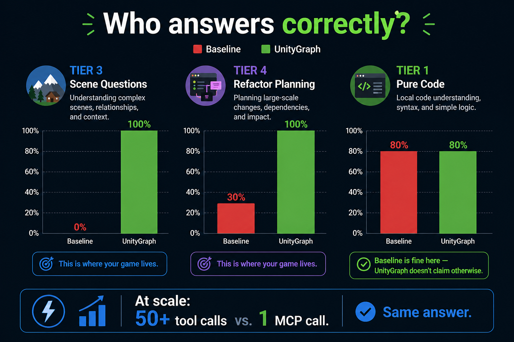
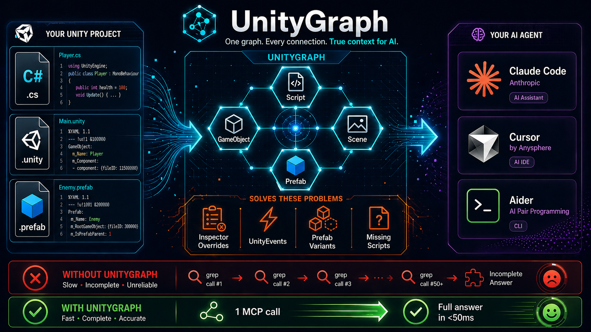

# UnityGraph



**Make Unity projects queryable for any AI coding agent.**

Your AI agent can read your `.cs` files. It cannot open your Unity scene.
It doesn't know that `_speed` is `7.0` on the `Player` GameObject in the
scene (the code says `5.0f`). It doesn't know the UI Button fires
`OnAttackPressed`. It doesn't know your prefab variant overrides
`maxHealth = 150`. All of that lives in Unity's YAML -- invisible to
source-only context.

UnityGraph parses scenes, prefabs, scripts, animators, and shadergraphs
into a single graph, exposes it via MCP (Model Context Protocol), and
lets your agent query it like any other tool. **The graph carries source
evidence**: every code-derived edge knows the file, line, snippet, and
method it came from.

Works with Claude Code, Cursor, Windsurf, Aider, any MCP-aware editor.
No Editor required. No LLM inside UnityGraph. Local-only.

---

## Quick start (90 seconds)

```bash
# 1. Install (Python 3.11+ required)
pip install unitygraph

# 2. Initialize your Unity project
cd /path/to/your/unity/project
unitygraph init .

# 3. Build the graph
unitygraph build .

# Done. Open your editor -- the MCP server is auto-detected.
```

### One-line install via Claude Code

Have Claude Code (or any MCP-aware agent) open in your Unity project?
Paste this:

> `Install UnityGraph in this Unity project: https://github.com/Shades-28/UnityGraph`

The agent reads the README, checks for Python 3.11+, installs via
pipx, runs `unitygraph init .`, builds the graph, and verifies the
MCP server. **One line, one paste, done.** If anything fails (e.g.
Python missing), the agent tells you and stops -- no half-installed
state.

A native Unity Package Manager (UPM) wrapper that bundles the runtime
is planned for v2.2 and will remove the Python prerequisite entirely.

**Don't have a Unity project to test on?** Try the bundled demo:

```bash
unitygraph init --demo my-demo-project
cd my-demo-project
unitygraph build .
unitygraph viz graph-out/graph.json   # opens at http://127.0.0.1:7842
```

The Observatory loads the demo's force-directed graph in your browser.
**Click any orange edge** to see the source-level evidence popover --
file:line:snippet for every relationship.



### See it in action

> **[Watch the Observatory demo on YouTube](https://youtu.be/23-Hw99vl9o)**
> A walkthrough on a real Unity project (~6,000 nodes, 7,750 edges). Click
> any edge, see its source evidence.

---

## Why it exists

Claude Code (or Cursor, etc.) makes a refactoring decision based on the
code it can read. On a real Unity project, that's wrong roughly as often
as scene values diverge from code defaults -- which is **a lot**:

| Project size       | Scripts | Inspector overrides | UnityEvent wirings | Missing-script refs |
|---|---:|---:|---:|---:|
| Small (a tutorial) | ~50     | ~10                 | 2                  | 0                   |
| Medium (typical)   | ~300    | ~700                | 135                | 15                  |
| Large (production) | 1,500+  | **15,000+**         | 470+               | 25+                 |

Every one of those facts is invisible to a code-only reader. UnityGraph
extracts them, attaches each one to a file:line, and serves them to your
agent in milliseconds.

---

## What's in the graph

Build a project and you get a `graph-out/graph.json` with:

- **Nodes**: Script, GameObject, Component, Scene, Prefab, AnimatorController,
  AnimState, ShaderGraph
- **Edges**: `attached_to`, `co_exists_with`, `depends_on`, `inherits`,
  `subscribes_to`, `overrides`, `is_variant_of`, `transitions_to`,
  `loads_scene`, and more
- **Sites**: every code-derived edge carries an array of evidence sites
  with `file`, `line`, `col`, `snippet`, `kind` (`get_component`,
  `method_call`, `find_object`, `inherits`, `subscribes_to`,
  `attached_to`, `prefab_override`, etc.) -- Roslyn-style: one logical
  edge, many evidence locations.

The schema is backwards-compat: v1.x graphs load fine in 2.x readers
(empty `sites: []` per edge).

---

## Available MCP tools

After `unitygraph init`, your editor sees these tools (all local, all
sub-50ms):

**Direct lookups:**
- `get_components(gameobject)` -- every component on a GameObject across all scopes
- `get_inspector_values(component, gameobject)` -- Inspector values + flagged overrides vs. code defaults
- `get_event_connections(gameobject)` -- UnityEvent listeners targeting this object
- `get_scene_graph(scene)` -- full GameObject list for a scene
- `get_prefab_chain(prefab)` -- variant inheritance chain with override entries

**Refactor planning:**
- `who_uses(script)` -- every inbound reference: attachments, GetComponent / method callers, subclasses, UnityEvent listeners. With evidence sites.
- `impact_of(script)` -- outbound blast radius, multi-hop
- `find_singletons(min_attachments)` -- user-owned scripts attached everywhere (defaults filter out Unity built-ins / third-party packs)
- `inspector_overrides_for(script)` -- per-attachment Inspector vs code-default diff
- `field_wiring(script, field)` -- every UnityEvent listener bound to a serialized field
- `event_listeners(script)` -- all callbacks landing on a script's methods
- `find_missing_scripts()` -- broken script references (the silent killer in big Unity projects)

**Graph navigation:**
- `find_script_usages(script)`
- `get_neighbors(node, hops)`
- `shortest_path(from, to)`
- `query_graph(text)` -- keyword search

---

## Has it been tested?

Yes. The repo includes a runnable bake-off harness in `evals/bakeoff/`
comparing baseline file tools (Read/Glob/Grep) to UnityGraph on the
same questions, across three real projects of increasing size. Drive
it with `python evals/bakeoff/focused_run.py` after pointing
`UNITYGRAPH_EVAL_ROOT` at your local Unity-project corpus.



**Headline**: on Tier 1 (pure-code questions answerable by reading one
.cs file), baseline grep is fine -- UnityGraph doesn't claim otherwise.
On Tier 3 (scene-code-gap questions: Inspector overrides, UnityEvent
wirings, prefab variants) UnityGraph wins decisively because baseline
literally cannot answer without re-implementing UnityGraph's guid
index in grep. On Tier 4 (refactor planning across cross-asset
boundaries), baseline runs into the cost wall -- e.g., 6,660 Inspector
overrides on a single script across 1,110 attachments isn't something
a developer can grep their way through in conversation.

UnityGraph also **honestly admits its limits**: method bodies aren't
stored (it points you at the file:line), return types aren't tracked
(`async Task` enumeration falls back to grep), string-based dispatch
(`SendMessage`, `Invoke`) isn't typed and can't be tracked. An agent
combining UnityGraph queries + file tools is strictly better than either
alone.

For the full methodology, ground-truth verification, per-question
breakdown, and reproducible harness, see
[`docs/whitepaper.md`](docs/whitepaper.md).

---

## Observatory (visualization)

```bash
unitygraph viz path/to/your/graph.json
```

Opens an interactive force-directed graph at `http://127.0.0.1:7842`.
Defaults to the user-script subgraph; toggle "full graph" if you want
everything. Click any edge to see its evidence sites.

---

## Update path

When a newer UnityGraph ships:

```bash
# Update the package
pip install -U unitygraph

# In each Unity project that uses it
cd /path/to/your/unity/project
unitygraph update .
```

This refreshes the MCP config, the `.claude/skills/` definitions, and
rebuilds the graph (incremental -- uses the parse cache).

The cache key includes a `PARSER_VERSION` int that bumps on every
incompatible parser change, so old cached entries rebuild cleanly on
upgrade. No manual cache invalidation needed.

---

## Architecture



UnityGraph is **middleware**. It does not chat. It does not call an LLM.
It does one thing -- turn Unity projects into a queryable graph that any
MCP-aware agent can use.

- `src/unitygraph/build/` -- parsers (C#, Unity YAML, animator,
  shadergraph) + the builder that emits `graph.json`
- `src/unitygraph/mcp/` -- query library + stdio MCP server
- `src/unitygraph/viz/` -- local web Observatory
- `src/unitygraph/inject/` -- task-aware context-block formatter (Layer 2)
- `src/unitygraph/behavior/` -- failure-pattern observation loop (Layer 3)

Layers 2 and 3 are optional (`pip install "unitygraph[full]"`).

---

## Limits, by design

- **No method bodies.** UnityGraph stores call sites, not source code.
  For "what does this method do?" point your agent at the file:line.
- **No return types.** Methods record name + line + lifecycle, not
  `async Task` / `Task<T>`.
- **No string-based dispatch.** `SendMessage("Foo")` is invisible to the
  graph because the target is a string literal at runtime, not a typed
  call.
- **Properties are partially tracked.** Field receivers resolve through
  inheritance; property getters that look like fields are best-effort.
- **Scenes that don't have scripts at parse time** show their guids as
  external placeholders. `find_missing_scripts` surfaces these -- useful
  for triaging legacy projects.

These are documented as scope, not as bugs.

---

## Contributing

Bug reports and PRs welcome. The repo includes:

- 184+ unit + integration tests (`pytest`)
- Cross-project validation tests (`tests/integration/test_external_projects.py`)
  that point at a corpus of real Unity projects via
  `UNITYGRAPH_EVAL_ROOT` env var
- A reproducible bake-off harness in `evals/bakeoff/`

Style: `ruff check`, `mypy --strict`. CI in `scripts/ci.sh` /
`scripts/ci.ps1`.

---

## License

[MIT](LICENSE) -- use it, modify it, ship it. Just keep the copyright
notice. Authored by Aryan Reniwal (shades).
